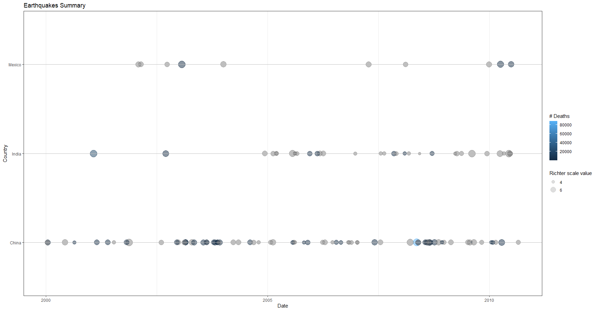
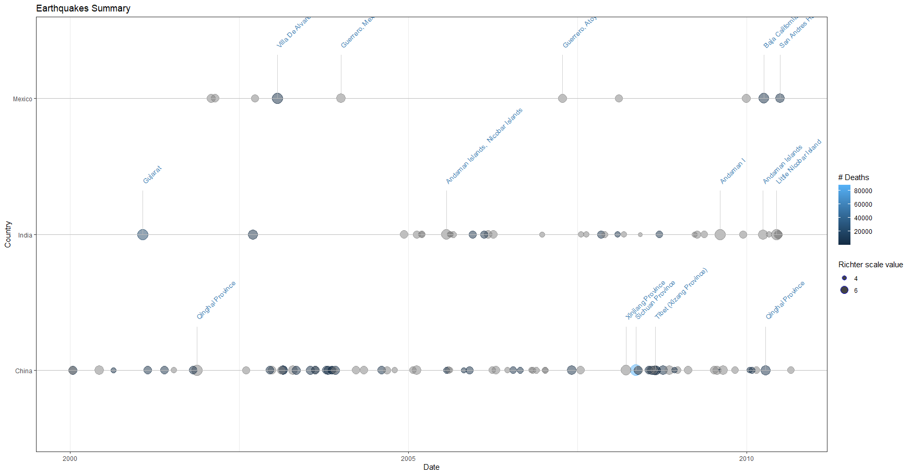
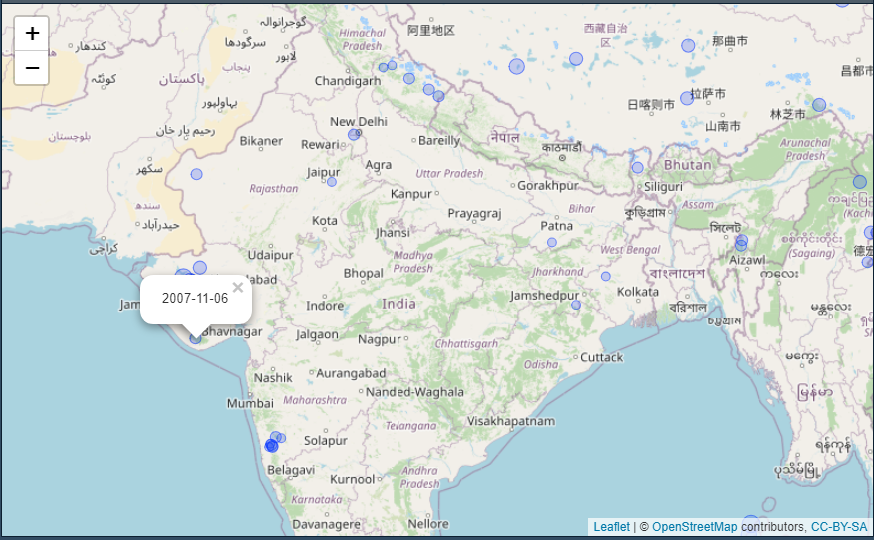

<!-- README.md is generated from README.Rmd. Please edit that file -->

## 1. Objective

As part of the Capstone project under the Mastering Software Development
in R by Coursera, this package is developed to clean and plot NOAA
earthquake data.

## 2. Obtaining clean dataset from the raw data

The raw earthquake data can be downloaded in the .tsv format from
<https://www.ngdc.noaa.gov/hazel/view/hazards/earthquake/search>

To clean the raw data and prepare it for analysis, we have
eq\_clean\_data() function which does the following cleanup tasks:

1.  Creates a Date field which is of class Date from the year, month and
    day fields.
2.  Converts the lat/ lon coordinates into numeric type
3.  Uses the eq\_location\_clean() function to create a field called
    Location\_Name which is stripped out from combined string of country
    and location names. It also converts location into title case for
    better annotation.

<!-- -->

    eq_clean_data <- function(dataframe){

        d2 <- dataframe
        d2 <- d2 %>%
          dplyr::mutate(Latitude= as.numeric(Latitude)) %>%
          dplyr::mutate(Longitude= as.numeric(Longitude)) %>%
          dplyr::mutate(Date = lubridate::make_date(Year, Mo, Dy)) %>%
          dplyr::arrange(desc(Mag)) %>%
          eq_location_clean()
        return(d2)
    }

### *Obtaining cleaned location name*

The eq\_location\_clean() function called by the eq\_clean\_data()
function explained above is shown below for reference

    eq_location_clean <- function(dataframe){

      d1 <- dataframe
      d1 <- d1 %>%
        tidyr::separate('Location Name',c("Country", "Location_Name"),": ") %>%
        dplyr::mutate(Country = stringr::str_trim(str_to_title(Country, locale = "en"))) %>%
        dplyr::mutate(Location_Name = stringr::str_trim(str_to_title(Location_Name, locale = "en")))
      return(d1)
    }

## 3. Creating plots to visualize earthquake data

In this section, we will discuss the geoms built to create desired
visualization plots.

### 3.1 *geom\_timeline* geom

This is used to create a timeline chart representing

-   earthquake occurrence represented on timeline for country/ countries
    as a point  
-   magnitude of earthquake represented by size of the point
-   colour gradation representing number of deaths due to earthquake

<!-- -->

    Plot1 <- eq_rawdata %>%
    eq_clean_data() %>%
    select(c("Country", "Location_Name", "Date", "Mag", "Latitude", "Longitude", "Deaths")) %>%
    filter(Country %in% c("India", "China", "Mexico")) %>%
    filter(Date>="2000-01-01" & Date<"2010-12-31") %>%
    ggplot(aes(x=Date, y=Country, color = Deaths, size = Mag, label=Location_Name)) +
    geom_timeline() +
    scale_size_continuous(name = "Richter scale value", breaks = c(2,4,6)) +
    scale_color_continuous(name = "# Deaths") +
    theme_bw() +
    theme(legend.position = "right")+
    labs(title = "Earthquakes Summary")
    Plot1

A sample of the resulting chart is shown below:

### 3.2 *geom\_timeline\_label* geom

This is used to add a layer of annotation on the geom\_timeline chart
which labels the top (n\_max) by magnitude earthquakes using a vertical
line.

    Plot2 <- eq_rawdata %>%
    eq_clean_data() %>%
    select(c("Country", "Location_Name", "Date", "Mag", "Latitude", "Longitude", "Deaths")) %>%
    filter(Country %in% c("India", "China", "Mexico")) %>%
    filter(Date>="2000-01-01" & Date<"2010-12-31") %>%
    ggplot(aes(x=Date, y=Country, color = Deaths, size = Mag, label=Location_Name)) +
    geom_timeline() +
    geom_timeline_label() +
    scale_size_continuous(name = "Richter scale value", breaks = c(2,4,6)) +
    scale_color_continuous(name = "# Deaths") +
    theme_bw() +
    theme(legend.position = "right")+
    labs(title = "Earthquakes Summary")
    Plot2

A sample of the resulting chart is shown below:

## 4. Visualizing earthquake information on a map

The mapping functions require the leaflet package to run and will chart
a subset of earthquake events on a map. We will continue wth the data
subset used in previous examples above.

### 4.1 Using *eq\_map()* to display location and date (on click)

Requires a dataframe and annot\_col (short for annotation column) as
input. This function then returns a leaflet map that can be printed to
the viewer in RStudio.

    Map1 <- eq_rawdata %>%
    eq_clean_data() %>%
    select(c("Country", "Location_Name", "Date", "Mag", "Latitude", "Longitude", "Deaths")) %>%
    filter(Country %in% c("India", "China", "Mexico")) %>%
    filter(Date>="2000-01-01" & Date<"2010-12-31") %>%
    eq_map(annot_col = "Date")
    Map1

A sample view is shown below:

### 4.2 Using the same *eq\_map()* to display location and pop-up text.

The pop-up text comprising the location, magnitude and total deaths is
created using eq\_create\_label() function.

    Map2 <- eq_rawdata %>%
    eq_clean_data() %>%
    select(c("Country", "Location_Name", "Date", "Mag", "Latitude", "Longitude", "Deaths")) %>%
    filter(Country %in% c("India", "China", "Mexico")) %>%
    filter(Date>="2000-01-01" & Date<"2010-12-31") %>%
    mutate(popup_text = eq_create_label(.)) %>%
    eq_map(annot_col = "popup_text")
    Map2

A sample view is shown below:

